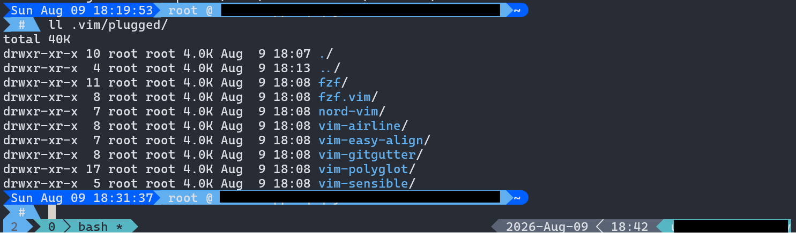

# . (dot) Files 

Dot/Config files

## Configs



----

### Bash Shell

Font: [NerdFont](https://www.nerdfonts.com/) + Cascadia Code (14pt)

Git Prompt Status

Bash Code

```bash
PROMPT_COMMAND='PS1_CMD1=$(__git_ps1 "%s")'; PS1='\[\e[38;5;27m\]\[\e[0;48;5;27m\]\d \t\[\e[94m\]\[\e[0;104m\] \u @ \H \[\e[38;5;27;7m\]\[\e[0;48;5;27m\]\w\[\e[0;38;5;27m\]\[\e[38;5;34m\]\[\e[0;48;5;34m\]${PS1_CMD1}\[\e[0;38;5;34m\]\n\[\e[0;104m\] \\$ \[\e[0;94m\]\[\e[0m\] '
```

Output, but in plain text

```text
 Sat Aug 08 HH:MM:SS  username @ FQDN  current path   Git 
 $  _
```

Resources:

* Terminal TrueColors - <https://github.com/termstandard/colors>
* <https://bash-prompt-generator.org/>

### tmux

Theme: Arctic Ice Studio / [Nord](https://www.nordtheme.com/ports/tmux)

#### Plugins

Plugin Manager: [tmux plugin manager](https://github.com/tmux-plugins/tpm)

* [tmux-sensible](https://github.com/tmux-plugins/tmux-sensible)
* [tmux-resurrect](https://github.com/tmux-plugins/tmux-resurrect)

Other resources and plugins: 

* <https://github.com/tmux-plugins>
* <https://github.com/jimeh/tmux-themepack>
* <https://tmux.app/config/>
* <https://tmux.app/cheat-sheet/>
* <https://github.com/rothgar/awesome-tmux>
* <https://github.com/tmux-plugins/list>
* <https://tmuxai.dev/tmux-config/>

### vim

Theme: Arctic Ice Studio / [Nord](https://www.nordtheme.com/ports/vim)

#### Plugins

Plugin Manager: [vim-plug](https://github.com/junegunn/vim-plug)

* [vim-sensible](https://github.com/tpope/vim-sensible)
* [vim-airline](https://github.com/vim-airline/vim-airline)
* [vim-polyglot](https://github.com/vim-polyglot/vim-polyglot)
* [fzf.vim](https://github.com/junegunn/fzf.vim)
  * [fzf](https://github.com/junegunn/fzf)
* [vim-gitgutter](https://github.com/airblade/vim-gitgutter)

To Install Plugins: `:PlugInstall`

Other Resources

* <https://github.com/powerline/powerline>
* <https://github.com/vim-airline/vim-airline-themes>
* <https://github.com/BurntSushi/ripgrep>
* <https://github.com/ggreer/the_silver_searcher>
* [Using VIM as IDE](https://medium.com/@edominguez.se/vim-101-a-comprehensive-guide-to-using-vim-like-an-ide-1-3-vimrc-d484cc41fc2)
* `find ~/.vim/ -type f -exec sed -i 's/\r$//' {} +` dam line endings

----

## Tested on:

* Windows 11 + Windows Terminal

## License

MIT, BSD, Public Domain, whatever you want

## Credits

* Install/Uninstall Script Source
  * <https://github.com/lawrencesystems/dotfiles/>
